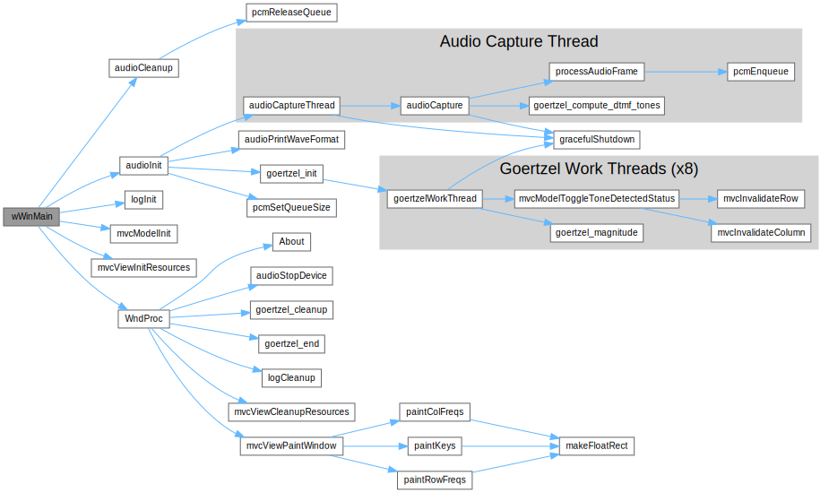

Architecture
============

The overall architecture of DTMF Decoder is very straightforward.

The main window is a 1-panel, hand-drawn, non-resizable window with a
telephone keypad on it.

The program opens the default audio capture device (there's no user interface
for selecting an audio device).  Then, it starts to listen to audio frames.

The most efficient way to listen to audio is to register a callback function
that gets called when the OS has a batch of audio frames to process.  So,
we spin up an audio capture thread, wait for audio, process the frames and
then release the buffer.

We use a [Goertzel Algorithm](https://en.wikipedia.org/wiki/Goertzel_algorithm)
to determine how much energy is in each DTMF frequency bucket.  This implementation
processes the time-domain PCM data in 1 pass (for each frequency) -- and
because DTMF needs to monitor 8 frequencies, it needs 8 passes/calculations.

For efficiency (and for fun) I chose to spin up 8 Goertzel Work Threads,
which wait (in parallel) for a batch of frames to come in.  When they arrive,
it signals all 8 threads to run in parallel and when **all** of the Goertzel
work threads finish, it signals the Audio Capture thread to continue
processing.

When a frequency surpasses a set threshold, the row or column frequency labels
are redrawn (in a highlighted color).  If both a DTMF row *and* column are
"on", then the key "lights up" as well.  Super simple.

Per [Raymond Chen](https://devblogs.microsoft.com/oldnewthing/author/oldnewthing)'s
book [The Old New Thing](https://www.amazon.com/Old-New-Thing-Development-Throughout/dp/0321440307/)
I should trust the Window's Update mechanism and repaint the display on the
main thread in WM_PAINT.  To that end, when each Goertzel thread finishes its
calculations, it checks to see if the state has changed.  If so, it invalidates
a rectangle (a full row or column) on the display.  Later on, the main application
message loop will get a WM_PAINT message and the screen will repaint.

Each element that gets drawn on the screen checks an "update rectangle".  If
the element is in the update rectangle, it gets drawn.  If not, then it must
not need to be updated.  This is the Win32 way of drawing.

For performance, I hand-coded an x86-64 Goertzel algorithm in Assembly
Language.  C is very "chatty" with memory, and this algorithm takes advantage
of:
  - Out-of-order processing
  - All of the intermediate variables are held in registers

The x86-32 bit version of the program uses a traditional C-based Goertzel
algorithm, for a reference design and comparison.

When you are running DTMF Decoder in a VM, it's still subject to the whims
of the hypervisor's scheduler.  Therefore, you may get frames with
DATA_DISCONTINUITY set.  However, when you run it on a bare-metal
Windows system, the performance is excellent and it processes all of the
audio in realtime.

DTMF Decoder has a good, simple logging mechanism.  It logs everything to
DebugView.  Logs to WARN, ERROR and FATAL will also popup a Dialog Box.  That's
it for a user interface.

So, it's a very simple program that took ~80 hours to write (4,800 minutes).
There's ~3,000 lines of code, so I'm averaging about 96-seconds per line.  Not
bad, per [The Mythical Man Month](https://en.wikipedia.org/wiki/The_Mythical_Man-Month)
but still, not great.

That said, it's been forever since I've written in Win32 and I'd write this
much faster if I had to do it again.  I've written a guide to the API calls I
use [here](REFERENCES.md).  I read every one of these to write this program.


## Shutdown
I've never had to work quite so hard to (correctly) shutdown a program as I've
had to for a [Win32](https://learn.microsoft.com/en-us/windows/win32/)
program.  There are so many scenarios to consider!  For example, shutting down...
   - Before any windows have been created
   - During the program's initialization (before the message loop has started)
   - In a thread (that has its own synchronization and doesn't spin the
     message loop)
   - A failure while cleaning up during shutdown (after the main window
     has been destroyed)
   - ...and a normal shutdown

Yikes!

Here's what I've learned about processes' end-of-life:
   - [Error Handling](https://learn.microsoft.com/en-us/windows/win32/debug/error-handling) by Microsoft
     - Well-written applications include error-handling code that allows them
       to recover gracefully from unexpected errors. When an error occurs, the
       application may need to request user intervention, or it may be able to
       recover on its own.
   - [Modern C++ Best Practices for Exceptions and Error Handling](https://learn.microsoft.com/en-us/cpp/cpp/errors-and-exception-handling-modern-cpp?view=msvc-170)
     - I do not plan to re-architect a Win32 program to use exceptions.
     - The native Win32 API doesn't seem to use C++ exceptions either. 
   - Work threads shouldn't display `MessageBox`es, so we need to queue a message, 
     initiate a shutdown and then print a `MessageBox` as it's winding down.
   - [The WM_QUIT_Message](https://devblogs.microsoft.com/oldnewthing/20050222-00/?p=36393)
   - [The difference between WM_QUIT, WM_CLOSE, and WM_DESTROY](https://stackoverflow.com/questions/3155782/what-is-the-difference-between-wm-quit-wm-close-and-wm-destroy-in-a-windows-pr)
   - [Terminating a Process](https://learn.microsoft.com/en-us/windows/win32/procthread/terminating-a-process)
   - [Terminating a Thread](https://learn.microsoft.com/en-us/windows/win32/procthread/terminating-a-thread)
   - I ran Spy++ on DTMF Decoder and captured the messages when I clicked the
     X in the upper-right corner.

         <000075> P WM_NCLBUTTONDOWN nHittest:HTCLOSE xPos:443 yPos:7
         <000076> P WM_MOUSEMOVE fwKeys:MK_LBUTTON xPos:439 yPos:-44
         <000077> P WM_LBUTTONUP fwKeys:0000 xPos:439 yPos:-44
         <000078> S WM_CAPTURECHANGED hwndNewCapture:00000000
         <000079> R WM_CAPTURECHANGED
         <000080> S WM_SYSCOMMAND uCmdType:SC_CLOSE xPos:443 yPos:7
         <000081> S WM_CLOSE
         <000082> S message:0x0090 [Unknown] wParam:00000000 lParam:00000000
         <000083> R message:0x0090 [Unknown] lResult:00000000
         <000084> S WM_WINDOWPOSCHANGING lpwp:0000001D5472DE00
         <000085> R WM_WINDOWPOSCHANGING
         <000086> S WM_WINDOWPOSCHANGED lpwp:0000001D5472DE00
         <000087> R WM_WINDOWPOSCHANGED
         <000088> S WM_NCACTIVATE fActive:False
         <000089> S message:0x0093 [Unknown] wParam:00000000 lParam:0000001D5472CB40
         <000090> R message:0x0093 [Unknown] lResult:00000001
         <000091> S message:0x0093 [Unknown] wParam:00000000 lParam:0000001D5472D460
         <000092> R message:0x0093 [Unknown] lResult:00000001
         <000093> S message:0x0091 [Unknown] wParam:00000000 lParam:0000001D5472D460
         <000094> R message:0x0091 [Unknown] lResult:00000000
         <000095> S message:0x0092 [Unknown] wParam:00000000 lParam:0000001D5472D3E0
         <000096> R message:0x0092 [Unknown] lResult:00000000
         <000097> S message:0x0092 [Unknown] wParam:00000000 lParam:0000001D5472D3E0
         <000098> R message:0x0092 [Unknown] lResult:00000000
         <000099> R WM_NCACTIVATE fDeactivateOK:True
         <000100> S WM_ACTIVATE fActive:WA_INACTIVE fMinimized:False hwndPrevious:(null)
         <000101> R WM_ACTIVATE
         <000102> S WM_ACTIVATEAPP fActive:False dwThreadID:00000DA8
         <000103> R WM_ACTIVATEAPP
         <000104> S WM_KILLFOCUS hwndGetFocus:(null)
         <000105> R WM_KILLFOCUS
         <000106> S WM_IME_SETCONTEXT fSet:0 iShow:C000000F
         <000107> S WM_IME_NOTIFY dwCommand:IMN_CLOSESTATUSWINDOW dwCommand:00000001 dwData:00000000
         <000108> R WM_IME_NOTIFY
         <000109> R WM_IME_SETCONTEXT
         <000110> S WM_DESTROY
         <000111> R WM_DESTROY
         <000112> S WM_NCDESTROY
         <000113> R WM_NCDESTROY
         <000114> R WM_CLOSE
         <000115> R WM_SYSCOMMAND

   - I can see `WM_CLOSE` and `WM_DESTROY`
   - `WM_QUIT` never makes it to the message handler... which makes sense, as
     soon as `GetMessage` gets it, it exits out of the `while()` loop.
   - [The convention for process exit codes](https://peteronprogramming.wordpress.com/2018/05/29/list-of-peculiar-exit-codes-on-windows/)
     in Windows is:
     - `0` means success
     - Anything else means failure
     - [Standard Windows application return codes](https://stackoverflow.com/questions/1538884/what-standard-application-return-exit-codes-should-an-application-support)
   - Win32 functions that return `BOOL` will return `0` on failure and non-`0` on 
     success...  A program's exit code does the opposite -- they return `0` on 
     success and non-`0` on failure.
   - Be mindful that Win32's `BOOL` datatype is an `INT`, not a `bool`.


### Error Handling Policy
   - (Done) **If the main window hasn't started**
     - Show a dialog box, then exit #wWinMain

   - **Inside the `initSomething` functions**
     - Unwind, returning `FALSE` until you get to the top, then show a `MessageBox`,
       set #giApplicationReturnValue and bubble up the error

     - The `initSomething` functions are called from #wWinMain before the 
       message loop starts...
      - Each init function called by #wWinMain has a custom error handler 
        that calls a unique set of cleanups depending on how far the 
        initialization has progressed.  
        Finally, the handler calls `return EXIT_FAILURE`
      - The `somethingInit` functions should return `BOOL`s.
        - If everything initializes OK, bubble up `TRUE`s
        - If there are problems...
          - Print a message
          - Set #giApplicationReturnValue to #EXIT_FAILURE
          - Unwind any initialization that's aready been done
          - Bubble up `FALSE` back to #wWinMain

   - **After the message loop has started**
     - Set #giApplicationReturnValue and call #gracefulShutdown

   - Log all messages as a string resource
   
   - (Done) #gbIsRunning is set to `true` at exactly one place:  The start of #wWinMain

   - (Done) I've considered using [FlashWindow](https://learn.microsoft.com/en-us/windows/win32/api/winuser/nf-winuser-flashwindow)
     for errors or warnings, but that's not really what it's for, so I'm
     not using it.  The `MessageBox` approach used in log.cpp is closer to 
     the [Principle of Least Astonishment](https://en.wikipedia.org/wiki/Principle_of_least_astonishment)

   - (Done) `cleanupSomething` methods should always work and not `ASSERT`, even if
     their corresponding `initSomething` methods haven't run yet.  This allows
     us to call all of the `cleanupSomething` methods during initialization
     failures.

   - (Audio capture needs doing) There's an assymetry around starting and ending threads that needs
     explaining.  We start threads in #audioInit and #goertzel_Init (in
     addition to initializing their data structures).  However, we stop the 
     threads in #audioStopDevice and #goertzel_Stop.  Lastly we release
     resources in #audioCleanup and #goertzel_Cleanup.  This is because
     the the audio and goertzel systems have interdependent data structures,
     so when it comes time to terminate the program we first need to stop
     both subsystems, then release their resources.
     
   - Worker threads should not create windows.  This bears repeating.  Worker 
     threads should not create windows.  They don't have message loops, so   
     they will get out of sync and the controlling process will loose control 
     of them.  
     
     So, how can they communicate problems and safely shutdown the app?  Let's
     post a custom message back to the main thread.  Here's the plan:

     - Create a GUID
     - Register the app name + GUID
     - When threads have problems, they post a message to the custom message.  
       - The high part of WPARAM is the thread number.  The low part is a
         resource string ID number. 
       - The macro #CLOSE_FATAL does this in one line
       - LPARAM is not used.
     
   - Use #logSetMsg, #logGetMsgId, #logGetMsgLevel, #logQueueReset and #logQueueHasMsg to
     print messages when its safe to do so (as the application is 
     shutting down).
     
   - **A normal close operation**
     - On `WM_CLOSE` - The start of a normal close... start unwinding things
       - Set #gbIsRunning to `false`
       - Call #goertzel_Stop
       - Trigger the audio capture thread loop
         - When `WaitForSingleObject` returns, it will see that #gbIsRunning
           is `false`, terminate the loop, then cleanup all things audio.
       - Call #audioStopDevice ??? Need to think about this ???
       - Call `destroyWindow` - This is standard Win32 behavior
     - On `WM_DESTROY`
       - Cleanup the view
       - Call `PostQuitMessate( giApplicationReturnValue )` - This is standard Win32 behavior

   - (Done) We will not use [TerminateProcess](https://learn.microsoft.com/en-us/windows/win32/api/processthreadsapi/nf-processthreadsapi-terminateprocess),
     [TerminateThread](https://learn.microsoft.com/en-us/windows/win32/api/processthreadsapi/nf-processthreadsapi-terminatethread)
     or [FatalAppExitA](https://learn.microsoft.com/en-us/windows/win32/api/errhandlingapi/nf-errhandlingapi-fatalappexita)
     they are too big of a gun for this application.

   - (Done) Instead of using [ExitProcess](https://learn.microsoft.com/en-us/windows/win32/api/processthreadsapi/nf-processthreadsapi-exitprocess),
     we use the return value of [wWinMain](https://learn.microsoft.com/en-us/windows/win32/learnwin32/winmain--the-application-entry-point)
     to exit.
     - A normal exit returns #EXIT_SUCCESS (`0`)
     - An abnormal exit returns #EXIT_FAILURE... We don't need unique error
       codes for every type of error
     - The model will hold #giApplicationReturnValue, which will initially
       be set to #EXIT_SUCCESS (`0`).  Then, any function/error handler can set it
       which will then get passed out when the program terminates.

|                               | Normal Shutdown         | Abnormal Shutdown |
|-------------------------------|-------------------------|-------------------|
| Set #giApplicationReturnValue | #EXIT_SUCCESS (Default) | #EXIT_FAILURE     |
| Set #gbIsRunning to `false`   | Yes                     | Yes               |
| Post `WM_CLOSE`               | Yes                     | Yes               |
| Call #LOG_FATAL( message )    | No                      | Yes               |
| return                        | `TRUE`                  | `FALSE`           |


### Subsystems Shutdown Notes
- (Done) **Main Window Thread**
  - Init Error Handler

  - Running Error Handler
    - Mostly, this happens in the other subsystems, however:
      - Problems in the message loop will:
        - Call #CLOSE_FATAL, which:
          - Posts an application-specific message `guUMW_CLOSE_FATAL` which 
            will gracefully shutdown the application by:
            - The message's `WPARAM` sends a resource string ID and an index 
              (usually a thread).
            - In the #guUMW_CLOSE_FATAL message handler:
              - Set #giApplicationReturnValue to #EXIT_FAILURE
              - Store a string resource ID and index to the logger via #logSetMsg
              - Call #gracefulShutdown
            - After all of the work threads have finished, the first WARN, ERROR
              or FATAL message
      - Problems in the message handlers will also call #CLOSE_FATAL

  - Normal Shutdown
    - #gracefulShutdown
      - Set #gbIsRunning to `false`
      - Post `WM_CLOSE`
    - WM_CLOSE will
      - Set #gbIsRunning to `false`
      - Cause the Audio capture thread to loop (and terminate) by setting 
        #ghAudioSamplesReadyEvent
      - Stop the audio capture device
      - Call `DestroyWindow`
    - WM_DESTROY will:
      - `NULL` out #ghMainWindow 
      - Call #mvcViewCleanup 
      - Call `PostQuitMessage`
    - WM_QUIT will:
      - Exit the message loop
    - As #wWinMain runs to the end... it will:
      - Stop the worker threads
      - Log the first WARN, ERROR or FATAL message (if any)
      - Cleanup resources in the reverse order they were created
      - Return with #giApplicationReturnValue

- (Done) **GDI / Direct2D**
  - Init Error Handler
    - Set #giApplicationReturnValue to #EXIT_FAILURE
    - Call #LOG_FATAL 
    - Call #gracefulShutdown
    - Return `FALSE` that bubbles up to the main thread
    - Because #gracefulShutdown was called, the main loop's 
      messages won't display
  - Running Error Handler
    - See the Main Window Thread's Running Error Handler
  - Normal Shutdown
    - Cleaned up in `WM_DESTROY` immediately after the window is destroyed
    - The cleanup method is very simple and never fails

- (Done) **Model**
  - Init Error Handler
    - Doesn't do anything.  Always returns `TRUE` (for now).
  - Running Error Handler
    - See the Main Window Thread's Running Error Handler
  - Normal Shutdown
    - Go through each item in the model and zero it out (or keep/ignore it)
    - Calls #pcmReleaseQueue

- (Done) **Logger**
  - Init Error Handler
    - It's so simple that it's always successful (but we check it anyways)
  - Running Error Handler
    - When Log functions throw exceptions, they will:
      ````
           OutputDebugStringA( "VIOLATED STACK GUARD in Logger.  Exiting immediately." );
           _ASSERT_EXPR( FALSE, L"VIOLATED STACK GUARD in Logger.  Exiting immediately." );
      ````
    ... (because they terminate immediately, they don't return error codes)
  - Normal Shutdown
    - At the very end of the program

- **Audio Capture Thread**
  - Init Error Handler
  - Running Error Handler
    - For TRACE, DEBUG and INFO, just log them
    - No WARN allowed
    - For ERROR and FATAL, see the Main Window Thread's Running Error Handler
  - Normal Shutdown

- (Done) **Goertzel DFT Threads**
  - Init Error Handler
    - #goertzel_Init is called in #audioInit... after some important audio 
      data structures are created but before the audio capture thread starts
    - Propagate errors up the call stack as `BOOL`s
  - Running Error Handler
    - See the Main Window Thread's Running Error Handler
  - Normal Shutdown
    - Call #goertzel_Stop to stop the threads.  #goertzel_Stop does not 
      return until all of the threads have stopped
    - #goertzel_Stop should be called _after_ ending the audio capture
      thread
    - After the threads are done, call #goertzel_Cleanup to close out the 
      resources it created


### Macros & Functions Supporting Shutdown
- #gracefulShutdown - Initiates a shutdown (can be normal shutdown or a shutdown
  due to a fatal error).
  - Set #gbIsRunning to `false`
  - Post `WM_CLOSE`
  - #gracefulShutdown will not shutdown the program **before** the message 
    loop starts; there's no queue to collect the `WM_CLOSE` yet
  - This is both a normal and failure-mode shutdown, so this doesn't set
    #giApplicationReturnValue
                      
- #gbIsRunning - A global `bool` that all of the worker threads watch

- Helper macros for checking the result of function calls (both to Win32 and 
  internal calls).  All of these macros use wide resource strings and 
  `printf`-style varargs.
  
  - The `CHECK-` macros rely on pre-declared return variable declarations
    `BOOL br` and `HRESULT hr`_and_ they depend on the function being tested 
    to set the return value
  
|                              | Check a `BOOL` result | Check an `HRESULT`    | Action taken         |
|------------------------------|-----------------------|-----------------------|----------------------|
| Immediately display messages | #CHECK_BR_R           | #CHECK_HR_R           | Call #RETURN_FATAL_R |
| Queue messages for later     | #CHECK_BR_C           | #CHECK_HR_C           | Call #QUEUE_FATAL    |
| Test for success or failure  | `if ( !br )`          | `if ( FAILED( hr ) )` |                      |

  - #WARN_BR_R warns on a BOOL failure
  
  - #RETURN_FATAL_R is very simple... it calls #PROCESS_FATAL_R and then 
    returns `FALSE`
    
  - #PROCESS_FATAL_R
    - Sets #giApplicationReturnValue to #EXIT_FAILURE
    - Calls #LOG_FATAL_R
    - Calls #gracefulShutdown
    
  - #QUEUE_FATAL
    - Sets #giApplicationReturnValue to #EXIT_FAILURE
    - Calls #LOG_FATAL_Q
    - Calls #gracefulShutdown
    

## Coding Conventions
The [C++ Core Guidelines](https://isocpp.github.io/CppCoreGuidelines/CppCoreGuidelines)
discourage prefix notation (for example, Hungarian notation).  Internally, the
Windows team no longer uses it. But its use remains in samples and documentation.

I choose to continue to use it.  See [Windows Coding Convention](https://learn.microsoft.com/en-us/windows/win32/learnwin32/windows-coding-conventions).

By convention, most `extern` functions will be named `subjectAction`.  This
tends to group them together (by subject).  If the last letter of subject 
is an `l`, then it's OK to name a function `subject_Action` as `l` is hard to 
distinguish from `I`.


## DTMF Decoder's Call Graph


