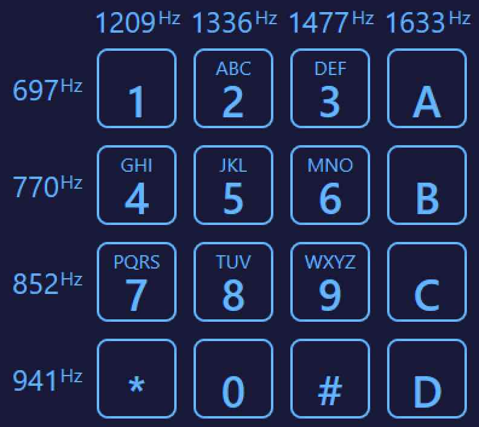

# DTMF_Decoder

This project was inspired by [Blue Box DTMF Decoder](https://apps.apple.com/us/app/blue-box/id391832739), an iOS app developed by [Sunshine Valley Systems](http://www.sunshinevalleysystems.com/BlueBox/index.html).

## Goals
- Write a DTMF and a tone decoder
- Get back to my roots as a Windows C Usermode programmer
- See what's changed in the last 25 years of programming
- Write a Forier Transform (or something like one)

## Design Decisions
- **The Application Framework:**  After reviewing [An Overview of App Development Options](https://learn.microsoft.com/en-us/windows/apps/get-started/?tabs=net-maui%2Cwindows-forms) 
  I'm going with **Win32**.  Here's a brief summary of my options:
  - **WinUI 3:**  This is the current recommended platform.  That said, it has a number 
    of deficiencies:
    - It's cross-platform and I don't need cross-platform support.  I'm not writing this for
      HoloLens, Xbox, Team, blah, blah.  
    - It rides on top of Win32 and I'd like to stay as close to the machine as possible.
    - I don't trust that it's a solid foundation i.e. [Silverlight](https://www.neowin.net/news/former-microsoft-pm-silverlight-is-dead/) 
      and one WinUI 3 reviewer [wrote](https://mariusbancila.ro/blog/2022/04/08/unwrapping-winui3-for-cpp/):
    > WinUI 3 is trumpeted as the next big thing in Windows development.  ... I personally don't see 
      this as the modern native library C++ Windows develoeprs have been wishing for the past
      12-15 years.  ... The API is cumberson at best.  The generated code is not optimal.  
      I think that time has shown that WinRT and UWP were a mistake.  WinUI, instead of 
      starting from scratch, sweeps the dirt under the carpet.  I think it's another mistake
      and time will tell whether I'm write or wrong.
  - **MFC:**  I like the Microsoft Foundation Class, but I think it works best when
    you have a 100% solid understanding of C and Win32 first.  Also, I'd like to write this
    in C and not C++
  - **WPF, Forms and UWP:** Same argument as the two above.

- **The Graphics Framework:**  I started down the GDI path, but good `old Stack Overflow pointed me 
  towards **Direct2D**. 
  - **GDI:**  It's depricated.  Also, I want to explore APIs that were written for GPUs.
  - **GDI+:**  I want to write this in C
  - I'm looking at [this](https://learn.microsoft.com/en-us/windows/win32/direct2d/getting-started-with-direct2d) 
    and [this](https://bobobobo.wordpress.com/2008/01/31/how-to-create-a-basic-window-in-c/) for a starting point

- **Logging:** I've been programming for a long time and grown accustomed to being
  able to write debug messages to the console.  I'm going to push myself a bit:  No console logging this time.
  Instead, I'm going to rely more on the debugger than I ever have before.  
  - Note:  Should I have chosen to do a console-based log, I'd have dumped to a syslog on localhost.
  - I think I'll try using [DebugOutputString](https://learn.microsoft.com/en-us/windows/win32/api/debugapi/nf-debugapi-outputdebugstringa)

## Tools
- [Doxygen](https://doxygen.nl)
- [DOT](https://graphviz.org/download/)
- [DIA for Windows](http://dia-installer.de/index.html.en)

