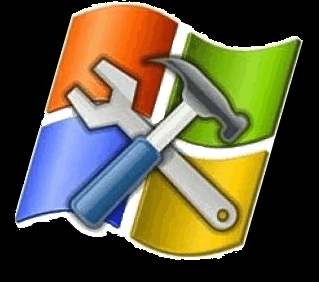

DTMF Decoder for Windows
========================

| DTMF Decoder                                                                                                                    |                                                                                                                                                                                                                                     | Blue Box                                                                                                                  |
|---------------------------------------------------------------------------------------------------------------------------------|-------------------------------------------------------------------------------------------------------------------------------------------------------------------------------------------------------------------------------------|---------------------------------------------------------------------------------------------------------------------------|
|  | This project (left) was inspired by [Blue Box DTMF Decoder](https://apps.apple.com/us/app/blue-box/id391832739), an iOS app developed by [Sunshine Valley Systems](http://www.sunshinevalleysystems.com/BlueBox/index.html) (right) |  |

## Goals
- Write a [DTMF](https://en.wikipedia.org/wiki/Dual-tone_multi-frequency_signaling)
  tone decoder
- Get back to my roots as a [Windows C Usermode](https://en.wikipedia.org/wiki/Windows_API)
  programmer
- See [what's changed](https://stackoverflow.com/questions/3121538/how-has-windows-api-changed-in-the-last-10-years)
  in the last 25 years of Windows Win32 programming (since I wrote paint from
  Charles Petzold's book [Programming Windows](https://www.amazon.com/Programming-Windows%C2%AE-Fifth-Developer-Reference/dp/157231995X))
- Write a model [Win32](https://learn.microsoft.com/en-us/windows/win32/) program
  that does everything correctly
- Write a [Fourier Transform](https://en.wikipedia.org/wiki/Fourier_transform)
  (or something like one)
- Write a good, general purpose logger that I can use with other projects

## Links
The project's home page (hosted by GitHub) is [here](https://github.com/marknelsonengineer/DTMF_Decoder)

The source code documentation (hosted by UH) is [here](https://www2.hawaii.edu/~marknels/DTMF_Decoder/)

## Design Decisions
- **The Application Framework:**  After reviewing [An Overview of App Development Options](https://learn.microsoft.com/en-us/windows/apps/get-started/?tabs=net-maui%2Cwindows-forms)
  I'm going with **Win32**.  Here's a brief summary of my options:
  - **WinUI 3:**  This is the current recommended platform.  That said, it
  has a number of deficiencies:
    - It's cross-platform and I don't need cross-platform support.  I'm not
      writing this for HoloLens, Xbox, Team, blah, blah.
    - It rides on top of Win32 and I'd like to stay as close to the machine as
      possible.
    - I don't trust that it's a solid foundation i.e. [Silverlight](https://www.neowin.net/news/former-microsoft-pm-silverlight-is-dead/)
      and one WinUI 3 reviewer [wrote](https://mariusbancila.ro/blog/2022/04/08/unwrapping-winui3-for-cpp/):
    > WinUI 3 is trumpeted as the next big thing in Windows development.
      ... I personally don't see this as the modern native library C++ Windows
      developers have been wishing for the past 12-15 years.  ... The API is
      cumbersome at best.  The generated code is not optimal.
      I think that time has shown that WinRT and UWP were a mistake.  WinUI,
      instead of starting from scratch, sweeps the dirt under the carpet.
      I think it's another mistake and time will tell whether I'm write or wrong.
  - **MFC:**  I like the Microsoft Foundation Class, but I think it works best
    when you have a 100% solid understanding of C and Win32 first.  Also, I'd
    like to write this in C and not C++
  - **WPF, Forms and UWP:** Same argument as the two above.

- **The Graphics Framework:**  I started down the GDI path, but good `old Stack
  Overflow pointed me towards **Direct2D**.
  - **GDI:**  It's deprecated.  Also, I want to explore APIs that are written for GPUs.
  - **GDI+:**  I want to write this in C
  - I'm looking at [this](https://learn.microsoft.com/en-us/windows/win32/direct2d/getting-started-with-direct2d)
    and [this](https://bobobobo.wordpress.com/2008/01/31/how-to-create-a-basic-window-in-c/) for a starting point

- **Logging:** I've been programming for a long time and grown accustomed to
  being able to write debug messages to the console.  I'm going to push myself
  a bit:
  - No console logging this time.
  - Instead, I'm going to rely more on the debugger than I ever have before.
  - I will use [DebugOutputString](https://learn.microsoft.com/en-us/windows/win32/api/debugapi/nf-debugapi-outputdebugstringa)

- **Performance:** (Unintended, but fun) Due to the realtime nature of the
  application, I had to hand-code a [Goertzel Algorithm](https://en.wikipedia.org/wiki/Goertzel_algorithm)
  (a type of [Discrete Fourier Transform](https://en.wikipedia.org/wiki/Discrete_Fourier_transform))
  in x86-64 Assembly Language.

- **Assertions:** I love assertions.  There's two ways to implement assert in
  a program like this:
  - Standard C [assert](https://learn.microsoft.com/en-us/cpp/c-runtime-library/reference/assert-macro-assert-wassert?view=msvc-170) macro
  - Win32 CRT Debugging tools like [_ASSERTE](https://learn.microsoft.com/en-us/cpp/c-runtime-library/reference/assert-asserte-assert-expr-macros?view=msvc-170)

  For this project, I'm going with _ASSERTE.  There are more options and this
  is an exploratory project.

  Note:  I compared the Debug and Release configurations of both of these
  techniques with Ghidra.  I was pleasantly surprised to see that both
  completely disappear in the Release versions.  In a Debug configuration,
  they have different implementations.

- **Cleaning up Threads:**  Most of the subsystems have a `cleanupSomething`
  function.  The threads also need `stopSomething` functions that trigger the
  threads to end (and wait until they actually do end).  One dilemma I faced
  is:  Should the `cleanup` function also stop the threads?  I think the answer
  is:  No.  I will have separate `cleanup` and `stop` functions.  The reason
  is that the threads use each others' resources.  I'm going to want to stop
  all of the threads first, then cleanup their resources.

## Toolchain
This project is the product of a tremendous amount of R&D and would not be
possible without the following world-class tools:

| Tool                                 | Website                                           |                                                Logo                                                                |
|--------------------------------------|---------------------------------------------------|:------------------------------------------------------------------------------------------------------------------:|
| **Visual Studio Community Edition**  | https://visualstudio.microsoft.com/vs/community/  |          |
| **Doxygen**                          | https://doxygen.nl                                |             |
| **Git**                              | https://git-scm.com                               |                     |
| **GitHub**                           | https://github.com                                |               |
| **DOT**                              | https://graphviz.org                              |                     |
| **DIA**                              | http://dia-installer.de                           |                     |
| **Sysinternals**                     | https://sysinternals.com/                         |   |
| **Ghidra**                           | https://ghidra-sre.org                            |               |

## Downloads
- [DOT](https://graphviz.org/download/)
- [DIA for Windows](http://dia-installer.de/index.html.en)
- [DebugView](https://learn.microsoft.com/en-us/sysinternals/downloads/debugview)
  from SysInternals

## Using DTMF Decoder
DTMF Decoder applies the [Unix philosophy](https://en.wikipedia.org/wiki/Unix_philosophy)
of doing one thing very well:  Decoding DTMF strings.   Therefore, it does not
provide a lot of status/popups/messages to users.   However, DTMF Decoder does
send quite a bit of data and status information to [OutputDebugString](https://learn.microsoft.com/en-us/windows/win32/api/debugapi/nf-debugapi-outputdebugstringa).
Therefore, using [DebugView](https://learn.microsoft.com/en-us/sysinternals/downloads/debugview)
is a good way to see what's going on inside.

## DTMF Decoder's Call Graph

Here's how the whole thing fits together.  Checkout [Architecture](ARCHITECTURE.md)

